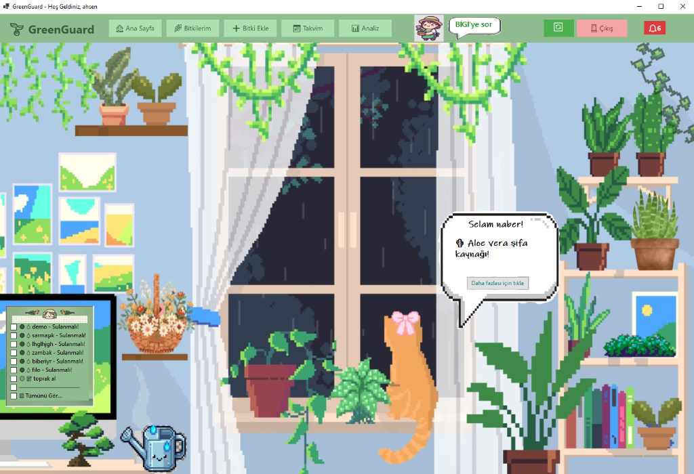
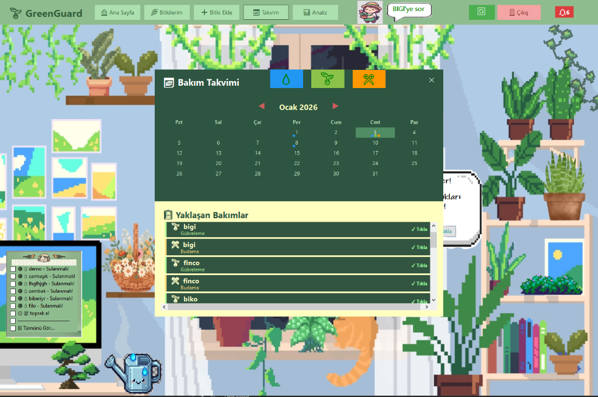
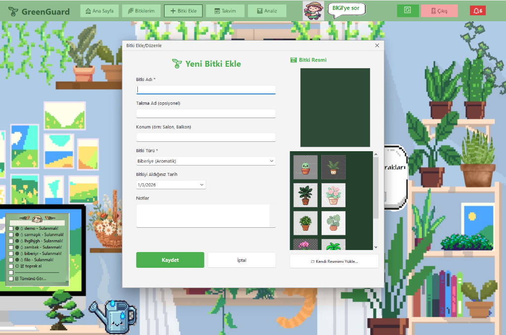
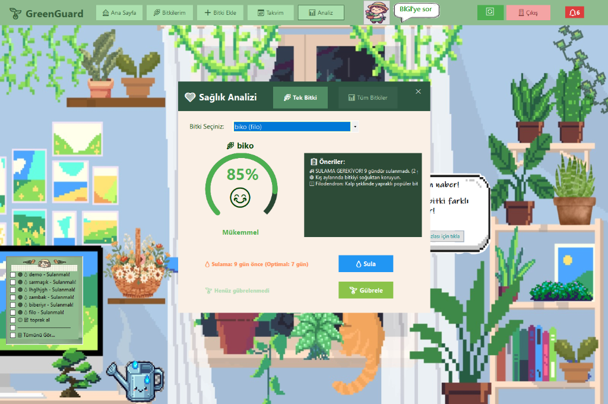
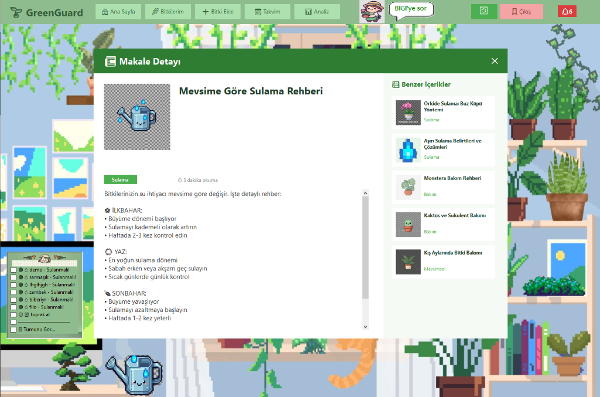

# 🌿 GreenGuard - Akıllı Bitki Bakım Asistanı

<div align="center">


**Bitkilerinizi seviyorsunuz ama bazen sulamayı unutuyor musunuz?** 🙈  
**GreenGuard sizin için burada!** 🦸‍♀️

*Pixel art temalı, eğlenceli ve akıllı bitki bakım uygulaması*

[📸 Ekran Görüntüleri](#-ekran-görüntüleri) • [🚀 Özellikler](#-özellikler) • [💻 Kurulum](#-kurulum) • [🛠️ Teknolojiler](#️-teknolojiler)

</div>

---

## 📸 Ekran Görüntüleri

### 🏠 Ana Sayfa - Pixel Art Dashboard
> *Huzurlu bir oda, sevimli bir kedi ve bitkileriniz!*



- 🎨 **Pixel art temalı** rahatlatıcı arayüz
- 🌿 **14 bitki slotu** ile koleksiyonunuzu yönetin
- 💧 **Sürükle-bırak sulama** - su kovası ile bitkilerinizi sulayın!
- 🔔 **Akıllı hatırlatmalar** - sol altta yapılacaklar listesi
- 💬 **Dönen ipuçları** - her gün yeni bilgiler öğrenin
- 🐱 **Sevimli kedi** sizi karşılar!

---

### 📅 Bakım Takvimi
> *Tüm bakım görevlerinizi tek bir yerde görün!*



- 📆 **Aylık takvim görünümü** ile planlama
- 🎨 **Renk kodlu bakım türleri**: 💧 Sulama, 🌱 Gübreleme, ✂️ Budama
- ✅ **Tek tıkla tamamla** - bakım yaptığınızı işaretleyin
- ⚠️ **Gecikmiş görevler** vurgulanır

---

### 🌱 Bitki Ekleme
> *Koleksiyonunuza yeni arkadaşlar ekleyin!*



- 📝 **Detaylı bitki profili** oluşturun
- 🏷️ **Takma ad** verin (örn: "Fiko", "Yeşilcan")
- 📍 **Konum** belirtin (Salon, Balkon, Yatak Odası...)
- 🎨 **Pixel art ikonlar** arasından seçin
- 📷 **Kendi fotoğrafınızı** yükleyin

---

### 💚 Sağlık Analizi
> *Bitkileriniz ne durumda? Hemen öğrenin!*



- 📊 **0-100 sağlık skoru** ile değerlendirme
- 😊 **Emoji göstergeleri** (Mükemmel, İyi, Riskli, Kritik)
- 💡 **Akıllı öneriler** - ne yapmanız gerektiğini söyler
- 🔘 **Hızlı işlem butonları** - Sula, Gübrele

---

### 📰 Bitki Haberleri & Rehberler
> *Bitki bakımı hakkında her şeyi öğrenin!*



- 📚 **50+ makale** bitki bakımı hakkında
- 🗂️ **Kategoriler**: Sulama, Bakım, Mevsimsel, Hastalıklar
- 🔗 **Benzer içerikler** önerileri
- 🕐 **Okuma süresi** göstergesi

---

## 🚀 Özellikler

### 🌿 Bitki Yönetimi
| Özellik | Açıklama |
|---------|----------|
| ➕ Bitki Ekleme | Detaylı profil ile yeni bitki ekleyin |
| ✏️ Düzenleme | İstediğiniz zaman bilgileri güncelleyin |
| 🗑️ Silme | Artık bakamadığınız bitkileri kaldırın |
| 📷 Fotoğraf | Kendi fotoğrafınızı veya pixel art seçin |

### 💧 Bakım Sistemi
| Özellik | Açıklama |
|---------|----------|
| 🖱️ Sürükle-Bırak Sulama | Su kovası ile interaktif sulama |
| 💦 Damla Animasyonu | Görsel geri bildirim |
| 📅 Takvim | Tüm bakımları tek ekranda görün |
| ✅ Tek Tıkla Tamamla | Hızlı bakım kaydı |

### 🔔 Hatırlatma Sistemi
| Özellik | Açıklama |
|---------|----------|
| 🤖 Otomatik Hatırlatmalar | Bitki türüne göre akıllı zamanlar |
| 📝 Manuel Notlar | Kendi hatırlatmalarınızı ekleyin |
| ⏰ 7 Gün Önceden | Unutmamanız için erken uyarı |
| 🔄 Anlık Güncelleme | Yenile butonu ile senkronize |

### 🤖 Yapay Zeka Desteği
| Özellik | Açıklama |
|---------|----------|
| 💬 BİGİ Asistan | Bitki bakımı sorularınızı yanıtlar |
| 🧠 Groq AI | Hızlı ve akıllı cevaplar |

---

## 💻 Kurulum

### Gereksinimler
- Windows 10/11
- .NET 10.0 SDK
- SQL Server LocalDB

### Adımlar

```bash
# 1. Repoyu klonlayın
git clone https://github.com/RAhsencicek/G-G.git

# 2. Proje klasörüne gidin
cd G-G

# 3. Bağımlılıkları yükleyin
dotnet restore

# 4. Veritabanını oluşturun
dotnet ef database update

# 5. Uygulamayı çalıştırın
dotnet run
```

---

## 🛠️ Teknolojiler

<div align="center">

| Teknoloji | Kullanım Amacı |
|-----------|----------------|
|  | Ana Framework |
|  | Masaüstü UI |
|  | Veritabanı ORM |
|  | Veritabanı |
|  | UI Bileşenleri |
|  | Yapay Zeka |

</div>

---

## 📂 Proje Yapısı

```
G-G/
├── 📁 Data/           # Veritabanı context
├── 📁 Forms/          # Windows Forms (13 form)
├── 📁 Models/         # Entity modelleri
├── 📁 Services/       # İş mantığı servisleri
├── 📁 Resources/      # Pixel art görseller
├── 📁 Migrations/     # EF Core migrations
└── 📄 Program.cs      # Uygulama giriş noktası
```

---

## 🎨 Özel Tasarım Detayları

- 🖼️ **Pixel Art Tema**: Tüm görsellernostaljik pixel art tarzında
- 🌈 **Yeşil Renk Paleti**: Doğayı yansıtan huzurlu renkler
- 🐱 **Maskot**: Sevimli turuncu kedi
- 💧 **Animasyonlar**: Sulama damlası efekti
- 🎮 **İnteraktif Elementler**: Sürükle-bırak, hover efektleri

---

## 👨‍💻 Geliştirici

<div align="center">

**Ahsen Çiçek**

[](https://github.com/RAhsencicek)

</div>

---

## 📜 Lisans

Bu proje MIT lisansı altında lisanslanmıştır.

---

<div align="center">

**🌿 Bitkilerinizi sevin, GreenGuard onları koruyacak! 🌿**

*Made with 💚 and lots of ☕*

</div>
